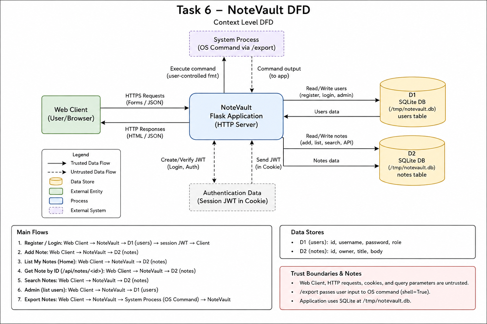
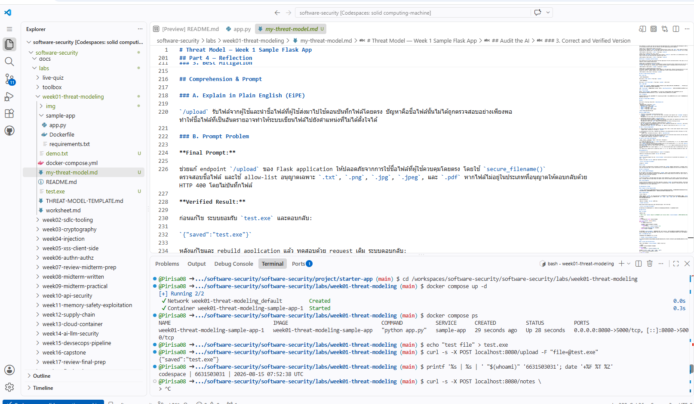
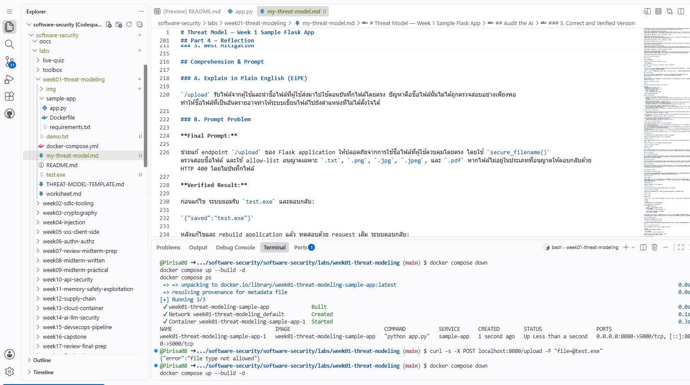

# Worksheet 1 — Security Mindset & Threat Modeling (3 hrs)

> **Course:** Software Security (KOSEN69) · **Week 1**
> **Aligned to:** OWASP 2025 A06 Insecure Design · CWE-501 (Trust Boundary Violation)
> **Signature game:** "Elevation of Privilege" (Microsoft STRIDE card deck)

> **Ethics note:** This week is *modeling only* — you analyze design, you do **not** attack the app. Run the sample app only on your own VM/localhost. Never apply these techniques to systems you do not own or lack written permission to test.

## Part 1 — Student Information
| Name | Student ID | Date | Group |
|---|---|---|---|
| Pirisa Kitichai| 6631503031 | 15/08/2026 | |

## Part 2 — Lecture Questions
Answer in your own words (2–4 sentences each).
1. Define the CIA triad and give one concrete failure example for each of the three properties.
2. What is a *trust boundary*, and why does data crossing one deserve extra scrutiny?
3. Explain "attack surface." Name two things that increase it in a web app.
4. What does each STRIDE letter map to, and which security property does each threat violate?
5. What does "Secure by Design" (CISA) mean, and how does it differ from bolting security on after release?

ANS ## Part 2 — Lecture Questions

1. CIA Triad ประกอบด้วย Confidentiality, Integrity และ Availability โดย Confidentiality คือข้อมูลต้องไม่ถูกเปิดเผยให้คนที่ไม่มีสิทธิ์, Integrity คือข้อมูลต้องไม่ถูกแก้ไขโดยไม่ได้รับอนุญาต และ Availability คือระบบต้องพร้อมใช้งาน ตัวอย่างเช่น ข้อมูลผู้ใช้รั่วคือ Confidentiality, ข้อมูลถูกแก้ไขคือ Integrity และระบบล่มจนใช้งานไม่ได้คือ Availability

2. Trust boundary คือจุดที่ข้อมูลเดินทางจากพื้นที่หรือระบบที่มีระดับความน่าเชื่อถือต่างกัน เช่น จากผู้ใช้บน Internet เข้าสู่ Web Application ข้อมูลที่ผ่านจุดนี้ควรถูกตรวจสอบ เพราะข้อมูลจากภายนอกอาจไม่น่าเชื่อถือหรือถูกสร้างขึ้นโดยผู้โจมตี

3. Attack surface คือทุกจุดของระบบที่ผู้โจมตีสามารถเข้าถึงหรือส่งข้อมูลเข้าไปได้ เช่น endpoint, form หรือ file upload สิ่งที่ทำให้ attack surface เพิ่มขึ้น เช่น การเพิ่ม API endpoint และการเพิ่มฟังก์ชัน upload file

4. STRIDE ประกอบด้วย Spoofing (ปลอมตัวตน), Tampering (แก้ไขข้อมูล), Repudiation (ปฏิเสธการกระทำ), Information Disclosure (ข้อมูลรั่ว), Denial of Service (ทำให้ระบบใช้ไม่ได้) และ Elevation of Privilege (เพิ่มสิทธิ์) โดยเกี่ยวข้องกับ Authentication, Integrity, Accountability, Confidentiality, Availability และ Authorization ตามลำดับ

5. Secure by Design คือการคิดและออกแบบเรื่องความปลอดภัยตั้งแต่เริ่มสร้างระบบ เช่น การกำหนด authentication และ authorization ตั้งแต่ขั้นออกแบบ ซึ่งดีกว่าการรอให้ระบบเสร็จหรือเกิดปัญหาแล้วค่อยเพิ่ม security เข้าไปภายหลัง

## Part 3 — Hands-on Lab (180 min)
**Learning goals:** build a data-flow diagram (DFD), apply STRIDE to a real Flask app, rank risks, and propose mitigations.
**Prerequisites:** Docker + Docker Compose in your VM; a drawing tool (draw.io / paper + photo); the Elevation of Privilege deck (print or virtual) — free print-and-play PDF at [github.com/adamshostack/eop](https://github.com/adamshostack/eop).

**Environment setup**
```bash
cd labs/week01-threat-modeling
docker compose up --build           # starts sample-app on http://localhost:8080
curl -s -X POST localhost:8080/notes -H 'Content-Type: application/json' \
     -d '{"owner":"alice","body":"hello"}'   # observe behavior, do not attack
curl -s localhost:8080/notes

echo "demo file" > demo.txt
curl -s -X POST localhost:8080/upload -F "file=@demo.txt"   # observe behavior, do not attack
curl -s localhost:8080/files/demo.txt
```

Source to model lives in `sample-app/app.py`. Template to fill: `THREAT-MODEL-TEMPLATE.md` (copy it, do not edit the original).

**What to submit per task:** the threat/element identified + a screenshot (DFD, table, or running app) + a 2–3 sentence mitigation.

**Task 0 — Onboarding (5 min)** · *Goal:* prove the environment works. *Steps:* `docker compose up`, hit `/notes` and `/files/<name>`, read `sample-app/app.py`. *Deliverable:* screenshot of the running app + the JSON response.

**Task 1 — Draw the DFD (25 min)** · *Goal:* map the system. *Steps:* identify the external entity (web client), the process (Flask app), the data store (`notes.db` SQLite), the `uploads/` store, and the flows for `/notes`, `/upload`, `/files/<name>`; mark the Internet→app trust boundary with a dashed line. *Deliverable:* DFD image embedded in your copy of the template.

## 1. Data-flow diagram


### Task 2 — STRIDE Analysis

The application should authenticate users and derive the note owner from the authenticated identity instead of trusting the client-supplied `owner` value. File uploads should use a validated or server-generated filename, and the application should add audit logging and resource limits to reduce repudiation and denial-of-service risks.

| Element | S | T | R | I | D | E |
|---|---|---|---|---|---|---|
| `/notes` | Client can spoof another user by supplying any `owner` value because there is no authentication. | A client can insert arbitrary note content into the database. | There is no logging, so actions cannot be reliably tied to a real user. | `GET /notes` returns all stored notes without access control. | Repeated POST requests could grow the database and consume resources. | No explicit authorization exists, so a client may perform actions that should require a trusted identity. |
| `/upload` | The uploader is not authenticated, so the server cannot verify who submitted a file. | `f.filename` is used directly in the save path, so user-controlled input influences filesystem writes. | There is no audit logging for uploads. | The response reveals the accepted filename and the upload behavior may expose information about server-side file handling. | Large or repeated uploads could consume disk space. | If file writes reach unintended locations, the impact could extend beyond the intended upload directory. |
| `/files/<name>` | No authentication is required to request a file. | This endpoint is read-only, so direct tampering risk is lower than `/upload`. | File access is not logged. | Anyone who knows a filename may be able to retrieve the uploaded file. | Repeated file requests could consume server resources. | Direct privilege escalation is limited here because `send_from_directory()` constrains file reads to the upload directory. |


**Task 3 — Elevation of Privilege game (20 min)** · *Goal:* find threats you missed. *Steps:* play the EoP deck against your DFD; each card you can tie to a real element/flow scores a point; record every valid threat. No printer or scissors? Draw from the digital deck below instead — same 78 cards, same rule. *Deliverable:* list of carded threats + score.

```sim
eop-deck
```
## Task 3 — Elevation of Privilege Game

I used the digital Elevation of Privilege (EoP) deck and drew five cards. I tied a card to my DFD only when the threat could honestly be connected to a real element or data flow in the sample application.

| Card | STRIDE | Result | Element / Flow | Finding |
|---|---|---|---|---|
| Denial of Service 3 | Denial of Service | Pass | — | The card describes draining an easily replaceable battery. The sample Flask application has no battery-powered component represented in the DFD, so there is no honest match. |
| Elevation of Privilege 5 | Elevation of Privilege | Valid (+1) | `/upload` → `uploads/` → `/files/<name>` | Filename/path data goes through different handling paths. `/upload` uses the client-supplied `f.filename` when saving, while `/files/<name>` uses `send_from_directory()` to constrain file reads. This inconsistent validation can create a security gap. |
| Denial of Service 10 | Denial of Service | Valid (+1) | `/upload` → `uploads/` | `/upload` accepts unauthenticated file uploads without an explicit upload-size or resource limit. Repeated uploads could consume persistent disk space, so the impact may remain after the attacker stops sending requests. |
| Denial of Service 7 | Denial of Service | Pass | — | The card describes making a client unavailable with a persistent effect. The analyzed Flask application does not provide a clear mechanism for causing this persistent client-side denial of service. |
| Denial of Service 6 | Denial of Service | Valid (+1) | Flask App / public endpoints | The application exposes endpoints without authentication or rate limiting. A large number of requests could temporarily consume server resources and reduce availability, with the effect ending when the request flood stops. |

**Cards Drawn:** 5  
**Tied to My DFD:** 3  
**Total Score:** 3

**Summary**
Three of the five drawn cards could be honestly connected to the sample application's DFD. The valid findings showed inconsistent filename/path handling and two denial-of-service risks: persistent resource consumption through file uploads and temporary server resource exhaustion through unauthenticated r

**Task 3b — Systems-level pass (25 min) 🔭** · *Goal:* find what the per-element grid cannot see. Tasks 2 and 3 enumerate threats **one element at a time**, and that is exactly where threat models are known to stop short — students taught STRIDE alone reliably identify component threats and *discount system-level ones* ([Joshi et al., ASEE 2024](https://arxiv.org/abs/2404.16632)). So do a second pass over the **whole** diagram:


### 1. Trust boundaries end-to-end

A request to `/notes` starts from the untrusted web client and crosses the Internet-to-application trust boundary before reaching the Flask application. The Flask application then accesses `notes.db` to store or retrieve note data, and the response travels back through the application to the client.

The most important unchecked crossing is the Internet → Flask application boundary. The application accepts the client-supplied `owner` value without authentication or authorization, so untrusted input is treated as if it represents a valid identity.

### 2. Owned-element reachability

**If the Flask process is fully compromised:**  
An attacker could reach both `notes.db` and the `uploads/` directory because the Flask process has legitimate access to both data stores. This could allow the attacker to read or modify notes and access or modify uploaded files.

**If the `uploads/` store is fully compromised:**  
An attacker could control files stored in the upload directory. Since `/files/<name>` serves files from this directory, attacker-controlled content could potentially be returned to clients through the Flask application.

### 3. Chain two low findings

Missing authentication on `/upload` → unrestricted repeated uploads → disk space is exhausted and the application becomes unavailable.

Another possible chain is:

Predictable/known uploaded filename → unauthenticated `/files/<name>` access → unauthorized disclosure of uploaded file contents.

### 4. One-line system claim

Even if every element-level mitigation in Task 8 is implemented, this system still fails if a compromised Flask process retains unrestricted access to both the database and uploaded files.


- **Trust boundaries end-to-end.** Follow one request from the client to `notes.db` and back. List every boundary it crosses. Which crossing has no check on it?
- **Assume one element is fully owned.** Pick the Flask process, then the `uploads/` store. For each: what does the attacker now *reach* — not what is it, but where does it get them?
- **Chain two "low" findings.** Find two threats you or the EoP deck rated minor that combine into something you would not accept. Write the chain as `A → B → consequence`.
- **One-line system claim.** Finish: "Even if every element-level mitigation in Task 8 is implemented, this system still fails if ___."

Use the simulation below before you start — toggle a component to attacker-controlled and watch what it reaches:

```sim
trust-boundary
```

*Deliverable:* the boundary list, two owned-element reachability notes, one written chain, and the system claim.

**Task 4 — Abuse cases & attacker personas (20 min)** · *Goal:* think like specific adversaries. *Steps:* define 2 personas (e.g. a curious logged-in user; an anonymous internet attacker) and write 2 abuse cases each against the sample app, tied to DFD elements. *Deliverable:* 4 abuse cases.

## Task 4 — Abuse Cases & Attacker Personas

### Persona 1 — Curious User

This attacker is a normal user who can access the web application but is curious about data belonging to other users. The attacker does not have administrative access and only interacts with the exposed application endpoints.

**Abuse Case 1 — Impersonating another note owner**  
The user sends a request to `/notes` and supplies another person's name in the `owner` field. Because the application does not authenticate the supplied owner, the Flask App accepts the value and stores the note in `notes.db` as if it belonged to that person.

**DFD elements:** Web Client → `/notes` → Flask App → `notes.db`

**Abuse Case 2 — Reading other users' notes**  
The user sends `GET /notes` and receives all notes stored in `notes.db`. Since there is no authentication or per-user authorization check, the user may see notes that were created by other users.

**DFD elements:** Web Client → `/notes` → Flask App → `notes.db`

### Persona 2 — Anonymous Internet Attacker

This attacker has no account and accesses the Flask application from the untrusted Internet. Their goal is to misuse publicly reachable endpoints without needing authentication.

**Abuse Case 3 — Uploading uncontrolled files**  
The attacker sends files to `/upload`. The application accepts the upload without authentication and uses the client-controlled `f.filename` when creating the filesystem path, allowing untrusted input to influence writes to the file store.

**DFD elements:** Web Client → `/upload` → Flask App → `uploads/`

**Abuse Case 4 — Consuming application resources**  
The attacker repeatedly sends uploads or other requests to the application. Because the application has no visible rate limiting or upload-size controls, repeated requests could consume disk or server resources and reduce availability.

**DFD elements:** Web Client → Flask App → `uploads/`


**Task 5 — Path-traversal deep-dive (25 min)** · *Goal:* analyze the riskiest flow. *Steps:* trace `/upload` → `/files/<name>`; explain how `../` in a filename escapes `uploads/`; sketch the secure design (`secure_filename`, store outside web root, allow-list extensions). *Deliverable:* the data flow + secure-design note.

### 1. Data Flow

เส้นทางการอัปโหลดไฟล์:

Web Client → `POST /upload` → Flask App → `uploads/`

เส้นทางการอ่านไฟล์:

Web Client → `GET /files/<name>` → Flask App → `uploads/` → Web Client

### 2. ความเสี่ยง

`/upload` ใช้ `f.filename` ที่มาจากผู้ใช้โดยตรงในการสร้าง path สำหรับบันทึกไฟล์ หากชื่อไฟล์มี `../` อาจทำให้ path ออกจากโฟลเดอร์ `uploads/` และเขียนไฟล์ไปยังตำแหน่งที่ไม่ควรได้

ส่วน `/files/<name>` ปลอดภัยกว่าฝั่ง upload เพราะใช้ `send_from_directory()` เพื่อจำกัดการอ่านไฟล์ให้อยู่ใน directory ที่กำหนด

### 3. Secure Design

ควรใช้ `secure_filename()` ตรวจสอบชื่อไฟล์, ใช้ allow-list จำกัดประเภทไฟล์ และเก็บไฟล์ไว้นอก web root นอกจากนี้ควรสร้างชื่อไฟล์ใหม่จากฝั่ง server เช่น UUID แทนการใช้ชื่อไฟล์จากผู้ใช้โดยตรง

### 4. Mitigation

ไม่ควรนำข้อมูลจากผู้ใช้มาเป็นส่วนหนึ่งของ filesystem path โดยตรง การใช้ชื่อไฟล์ที่ server สร้างเองช่วยลดความเสี่ยงของ path traversal และ arbitrary file write

**Task 6 — Threat-model the project target (30 min)** · *Goal:* kick off your term project. *Steps:* stop the sample-app first (`docker compose down` — both apps bind host port 8080), then run **NoteVault** (`cd ../../project/starter-app && docker compose up`), draw a quick DFD, and list the top 3 STRIDE threats you'd investigate. *Deliverable:* NoteVault DFD + top-3 threats (reuse these in your project report — `project/REPORT-TEMPLATE.md` in the repo root).

### DFD

Web Client → Flask App → SQLite DB (`/tmp/notevault.db`)

Main flows:
- Register/Login → Flask App → `users`
- Home/Notes → Flask App → `notes`
- `/api/notes/<id>` → Flask App → `notes`
- `/search` → Flask App → `notes`
- `/admin` → Flask App → `users`
- `/export` → Flask App → shell command

### Top 3 STRIDE Threats

1. **Spoofing / Elevation of Privilege — User can choose their own role**  
   `/register` accepts a client-supplied `role` value. A user can therefore request a privileged role such as `admin` instead of being forced to register as a normal user.

2. **Information Disclosure — Note ownership is not checked in `/api/notes/<id>`**  
   The endpoint checks only whether the requester is logged in, then retrieves a note by ID without checking whether the note belongs to that user. This may expose notes owned by another user.

3. **Tampering / Injection — Untrusted input reaches SQL and shell commands**  
   `/search` builds an SQL query using string formatting with the user-controlled search term, and `/export` concatenates `fmt` into a command executed with `shell=True`. Both flows cross trust boundaries without safe parameter handling.

### Mitigation

The application should enforce server-side authorization instead of trusting client-supplied roles, check note ownership before returning individual notes, and keep untrusted input out of SQL strings and shell commands. Parameterized SQL queries and avoiding `shell=True` would reduce these injection risks.



**Task 7 — Security requirements (15 min)** · *Goal:* turn threats into testable requirements. *Steps:* write 3 security requirements as acceptance criteria ("the system must … so that …"), each mapped to a threat from Task 2 or Task 6. *Deliverable:* 3 testable security requirements.
ANS ### Task 7 — Security Requirements

1. ระบบต้องตรวจสอบและทำความสะอาดชื่อไฟล์ที่อัปโหลดด้วย `secure_filename()` และอนุญาตเฉพาะนามสกุลไฟล์ที่กำหนด เพื่อป้องกัน Path Traversal และการอัปโหลดไฟล์อันตราย
   - Mapped threat: Task 2 — Tampering / Task 6 — File Upload

2. ระบบต้องมี Authentication ก่อนอนุญาตให้ผู้ใช้ดูหรือเพิ่ม Notes เพื่อป้องกันผู้ที่ไม่มีสิทธิ์เข้าถึงข้อมูล
   - Mapped threat: Task 6 — Spoofing / Information Disclosure

3. ระบบต้องบันทึก Log ของการกระทำสำคัญ เช่น การเพิ่ม Notes และ Upload File เพื่อให้สามารถตรวจสอบว่าใครเป็นผู้กระทำและเมื่อใด
   - Mapped threat: Task 2 — Repudiation

**Task 8 — Defend / fix it: rank & mitigate (25 min) 🛡️** · *Goal:* turn threats into action you can prove. *Steps:* rank the top 5 threats by likelihood × impact; propose one concrete mitigation each (e.g., auth on `/notes`, `secure_filename()` + allowlist for `/upload`, request logging for Repudiation, size/rate limits for DoS). Then **pick one and actually implement it** in your fork.

### Task 8 — Defend / Fix It

| Rank | Threat | Likelihood | Impact | Mitigation |
|---|---|---|---|---|
| 1 | Path Traversal ใน `/upload` | High | High | ใช้ `secure_filename()` และ allowlist ประเภทไฟล์ |
| 2 | Unauthorized access to `/notes` | High | High | เพิ่ม Authentication และ Authorization |
| 3 | Information Disclosure | Medium | High | จำกัดสิทธิ์การเข้าถึงข้อมูลของแต่ละผู้ใช้ |
| 4 | Repudiation | Medium | Medium | เพิ่ม request และ audit logging |
| 5 | Denial of Service | Medium | Medium | จำกัดขนาดไฟล์และเพิ่ม rate limit |

**Selected Fix:** Path Traversal ใน `/upload`

แก้ `/upload` โดยใช้ `secure_filename()` เพื่อล้างชื่อไฟล์ และใช้ allowlist เพื่ออนุญาตเฉพาะ `.txt`, `.png`, `.jpg`, `.jpeg` และ `.pdf`

**Commit:** `bea3ba7` — `Harden file upload handling`

**Top 5** 
### Task 8 — Defend / Fix It

| Rank | Threat | Likelihood | Impact | Mitigation |
|---|---|---|---|---|
| 1 | Path Traversal ใน `/upload` | High | High | ใช้ `secure_filename()` และ allowlist ประเภทไฟล์ |
| 2 | Unauthorized access to `/notes` | High | High | เพิ่ม Authentication และ Authorization |
| 3 | Information Disclosure | Medium | High | จำกัดสิทธิ์การเข้าถึงข้อมูลของแต่ละผู้ใช้ |
| 4 | Repudiation | Medium | Medium | เพิ่ม request และ audit logging |
| 5 | Denial of Service | Medium | Medium | จำกัดขนาดไฟล์และเพิ่ม rate limit |

**Selected Fix:** Path Traversal ใน `/upload`

แก้ `/upload` โดยใช้ `secure_filename()` เพื่อล้างชื่อไฟล์ และใช้ allowlist เพื่ออนุญาตเฉพาะ `.txt`, `.png`, `.jpg`, `.jpeg` และ `.pdf`

**Commit:** `bea3ba7` — `Harden file upload handling`

#### Before Fix



ก่อนแก้ไข ระบบยอมรับไฟล์ `test.exe` และบันทึกไฟล์ได้

#### After Fix



หลังแก้ไขและ rebuild ระบบปฏิเสธ `test.exe` และตอบกลับ `HTTP 400` โดยไม่บันทึกไฟล์

*Deliverable — the top-5 table, plus for the one you implemented:*
1. the **diff** (commit hash on your `wk01` branch),
2. **evidence it works**: the request that succeeded before your change and is refused after — both outputs,
3. **why it closes the class, not the instance** (2–3 sentences). `secure_filename()` on one endpoint is an instance fix; *"no user-supplied string ever becomes a path component"* is a class fix. Say which yours is, and if it's an instance fix, say what the class fix would be.

> **Why this is weighted.** Fewer than half of working developers can spot a security hole in code, and being shown vulnerabilities does not by itself teach you to find or close them. Exploiting is the half that feels like progress; defending is the half that transfers to your job.

## Part 4 — Reflection
1. Map your top finding to a CWE and to OWASP A06 (Insecure Design); explain the mapping in one sentence.
2. Name one real-world breach caused by a design flaw (not a missing patch) and what design control would have prevented it.
3. Of your five mitigations, which gives the most risk reduction per unit of effort, and why?
**ANS**
### 1. CWE / OWASP Mapping
The main finding is that `/upload` uses a user-supplied filename to create a filesystem path. This maps to **CWE-501 (Trust Boundary Violation)** and **OWASP A06: Insecure Design** because the application trusts user input without enough validation and control.

### 2. Real-world Breach
One example is the **Capital One data breach (2019)**, where an attacker was able to access data that should have been protected. Stronger access controls and better separation of privileges could have reduced the impact.

### 3. Best Mitigation
Using `secure_filename()` with an allowlist for `/upload` gives the most risk reduction for the effort. It is simple to implement and helps prevent unsafe filenames and disallowed file types.

## Grading rubric (100)
| Criterion | Points |
|---|---|
| Lecture questions (Part 2) | 20 |
| Exploitation + evidence (DFD + STRIDE table + EoP findings + screenshots) | 40 |
| Defense (top-5 ranking + mitigations) | 25 |
| Reflection (CWE/OWASP mapping + breach + best mitigation) | 15 |

**Assessed within the rows above** (they are not extra points — they are what those points are for):
- **Systems-level reasoning** (inside *Exploitation + evidence*, Task 3b): does the model reach past single elements to boundaries, reachability and chains? Scored with the STRIDE + systems-thinking rubrics of [Joshi et al. 2024](https://arxiv.org/abs/2404.16632).
- **Defensive proof** (inside *Defense*, Task 8): a claimed mitigation with no before/after evidence scores at most half. A mitigation you can show closing a *class* scores full.
- **Adversarial thinking** (across the whole sheet): do the abuse cases, personas and chains show you reasoning as an attacker with goals and constraints — or just listing categories? This is the course's central disposition and it is assessed, not assumed.

---

## Evidence & Integrity (required)

- **Identity proof:** every screenshot/diagram must show a terminal running `printf '%s | %s | ' "$(whoami)" '<YOUR-STUDENT-ID>'; date '+%F %T %Z'` **in the
  same image as the evidence**. When the evidence is a browser page, a DevTools panel or a
  rendered response, put that terminal **beside the browser and capture the whole screen** — a
  cropped window carries nothing that identifies you, and the lab's own output is
  byte-identical for the whole cohort *by design*, so the stamp is the only thing that makes
  the shot yours. Generic or borrowed evidence is not accepted.
- **Personalized flag (if this lab issues one):** ______TEFAEJJ8__________
  *Flags are unique per student — submitting another student's flag is a violation. How to submit: **learn.zcr.ai/submit** (full guide: `SUBMISSION.md` in the repo root).*
- **Explain in your own words** *(graded on your reasoning, not copied text):*
  1. What did you do, and **why did the vulnerability work**?
  2. **Why does your fix actually stop it** — and what could still break it?

---

## 🤖 Audit the AI (required)

AI is a power tool you must **distrust** — you are graded on your *critique*, not the AI's answer.

1. Ask an AI assistant to exploit **or** fix this week's vulnerability. Paste its full answer.
## Audit the AI

### 1. AI Answer

I asked an AI assistant:

> Fix the Flask `/upload` endpoint to prevent path traversal using `secure_filename()` and explain whether that fix is enough.

The AI suggested:

```python
from werkzeug.utils import secure_filename

@app.route("/upload", methods=["POST"])
def upload():
    f = request.files["file"]

    filename = secure_filename(f.filename)
    if not filename:
        return {"error": "invalid filename"}, 400

    f.save(os.path.join(UPLOAD_DIR, filename))
    return {"saved": filename}
```
The AI explained that secure_filename() reduces path traversal risk, but that additional controls such as an extension allowlist, file-size limits, and server-generated filenames would make the upload feature safer.

2. **Find what's wrong or risky** in it — insecure code, a subtly incomplete fix, a hallucinated API/function/CVE, a missed edge case, or wrong reasoning. Quote the exact line(s).

The main incomplete part was:

    filename = secure_filename(f.filename)

This sanitizes the filename, but it still allows users to upload file types that the application may not want, such as .exe. The fix was therefore safer than the original code, but it did not enforce an upload policy.

3. Produce the **correct, verified** version yourself and explain in 2–3 sentences why the AI's output was insufficient.

I improved the fix by combining secure_filename() with an allowlist:
  filename = secure_filename(f.filename)

if not filename:
    return {"error": "invalid filename"}, 400

allowed = {".txt", ".png", ".jpg", ".jpeg", ".pdf"}
ext = os.path.splitext(filename)[1].lower()

if ext not in allowed:
    return {"error": "file type not allowed"}, 400

f.save(os.path.join(UPLOAD_DIR, filename))

Before the fix, the application accepted test.exe and returned:

{"saved":"test.exe"}

After the fix and rebuild, the same request returned:

{"error":"file type not allowed"}

The AI answer was useful but incomplete because secure_filename() alone did not restrict unwanted file types. The verified version added an allowlist and proved the new behavior using the same request before and after the change.

> Disclose your AI use in the Part 1 table. This task counts toward your **Defense + Reflection** score.

---

## 🧠 Comprehension & Prompt (required)

**A. Explain in Plain English (EiPE).** In 2–3 sentences, in your own words, describe what this week's vulnerable code/endpoint actually *does* and *why it is exploitable* — explain the mechanism, don't dump jargon.

**B. Prompt Problem.** Write a **single prompt** that makes an AI produce a *correct, secure* fix for one finding. Run it: does the exploit now fail? If not, refine the prompt and try again. Submit the **final prompt + the verified result**.
*Graded on the prompt's precision and your verification — this trains problem decomposition and AI literacy (Denny et al. 2024).*

**ANS** Comprehension & Prompt
### A. Explain in Plain English (EiPE)

The `/upload` endpoint receives a file from the user and saves it using the filename provided by that user. This is risky because the filename is used as part of the server's file path without enough validation, so a malicious filename could cause the file to be written somewhere unintended.

### B. Prompt Problem

**Final Prompt:**

Fix the Flask `/upload` endpoint so that user-controlled filenames cannot be used unsafely. Use `secure_filename()`, allow only `.txt`, `.png`, `.jpg`, `.jpeg`, and `.pdf` files, return HTTP 400 for disallowed file types, and do not save rejected files.

**Verified Result:**

Before the fix, the application accepted `test.exe` and returned:

`{"saved":"test.exe"}`

After applying the fix and rebuilding the application, the same request returned:

`{"error":"file type not allowed"}`

The fix worked because the disallowed file was rejected and was no longer saved by the application.