# Worksheet 4 — Injection & Input Handling (3 hrs)

> **Course:** Software Security (KOSEN69) · **Week 4**
> **Aligned:** OWASP 2025 **A05 Injection** · **CWE-89** (SQLi), **CWE-78** (OS command injection), **CWE-434** (unrestricted upload)
> **Signature game:** 🐉 **SQLi Boss Fight** — each successful injection lands a "hit" on the boss; the boss falls when you dump every credential and land an RCE.

> ⚠️ **Ethics note:** All payloads here are for the provided sandbox (`vulnerable_app.py`) and your own DVWA/Juice Shop containers **only**. Never test systems you do not own or have written permission to test. Unauthorized injection is a crime under most computer-misuse laws.

## Part 1 — Student Information

| Name | Student ID | Date | Group |
|------|-----------|------|-------|
| Pirisa Kitichai | 6631503031 | 5/09/2026 |   |

## Part 2 — Lecture Questions

Answer in 2–4 sentences each.

1. Why does a **parameterized query** (`execute(sql, (params,))`) defeat SQL injection, while string formatting (`"... '%s'" % user`) does not? Reference how the database treats data vs. code.

**ANS** A parameterized query sends data and SQL structure separately, so the database binds user input as a literal value, never as syntax. String formatting builds the final SQL text first, so quotes or keywords inside the input become part of the query itself — that's why `alice'--` can break out and comment code only when concatenated.

2. In the `/ping` endpoint, `subprocess.run("ping -c 1 " + host, shell=True)` is vulnerable. Explain how `shell=True` turns user input into **CWE-78**, and how an argument array (`["ping","-c","1",host]`) removes the shell.

**ANS** `shell=True` spawns an actual shell to interpret the command string, so metacharacters like `;` or `$()` in user input get parsed as separate commands. An argument array (`["ping","-c","1",host]`) skips the shell entirely — the OS runs `ping` directly with `host` as one literal argument, so there's nothing left to interpret metacharacters.

3. Distinguish **input validation** (allow-list) from **output handling**. Why is validation alone insufficient defense for SQLi?

**ANS** Input validation (allow-list) restricts what's accepted before use; output handling controls how data is safely used at the point it reaches the interpreter (e.g. parameterized binding). Validation alone isn't enough for SQLi because edge cases or encoding tricks can still slip through, while parameterization structurally blocks code injection regardless of the characters used.

4. The `/upload` route saves any filename to disk (**CWE-434**). What two properties must a directory and a filename have for an upload to become remote code execution, and which does `solution_app.py` remove?

**ANS** The upload directory must be reachable/executable (web-served or later executed by another process), and the filename/extension must be attacker-controlled. `solution_app.py` removes the second property with `secure_filename()` + an extension allow-list, blocking `.py` even though the first property (directory not web-served) was already safe in this lab.

5. What is a **UNION-based** SQLi, and why must the injected `SELECT` return the same number of columns as the original query? Relate to `/search?q=' UNION SELECT username,password FROM users--`.

**ANS** A UNION-based SQLi appends a second `SELECT` to the original query so its results merge with the first. The injected `SELECT` must match the original's column count because SQL requires both sides of a `UNION` to align — here the search query returns two columns, so `SELECT username,password` fits and dumps `alice:alicepw` / `bob:bobpw`.


## Part 3 — Hands-on Lab (150 min)

**Learning goals:** extract data via SQLi, achieve OS command injection, exploit an unrestricted upload, then prove each fix in `solution_app.py` blocks the payload.

**Prerequisites:** Docker + Docker Compose, `curl`, a browser. Working dir: `labs/week04-injection/`.

### Environment setup

```bash
cd labs/week04-injection
docker compose up            # builds python:3.12-slim, installs flask, runs vulnerable_app.py
# vulnerable app -> http://localhost:8080   (service name: injection-lab, port 8080)
```
Optional secondary targets:
```bash
docker run --rm -it -p 80:80 vulnerables/web-dvwa        # DVWA  -> http://localhost
docker run --rm -p 3000:3000 bkimminich/juice-shop       # Juice Shop -> http://localhost:3000
```

**What to submit per task:** the exact **payload/command**, a **screenshot** of the response proving success, and a **2–3 sentence mitigation** in your own words.

---

**Task 0 — Onboarding (5 min).** Browse to `http://localhost:8080/login?user=alice&pw=alicepw` and confirm `Welcome alice`. Note the seeded users (`alice`, `bob`). Screenshot the working app. *Deliverable: screenshot.*

**Before you start — see why concatenation is the flaw** 🔬 Type any input and watch which characters the database will parse as *SQL* rather than as a name. The point is not the payload; it is that with concatenation the input becomes syntax, and with a parameterised query it structurally cannot. You will be asked to state that difference in your own words in Task 5.

```sim
sqli-parse
```
*Deliverable: screenshot.*

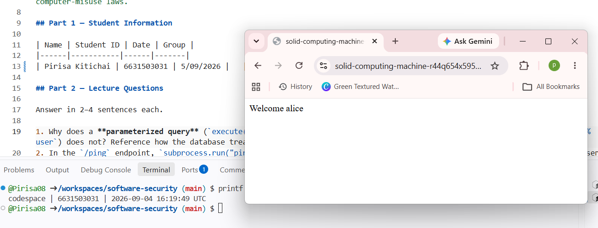

**Task 1 — Auth bypass via SQLi (25 min) 🐉 Hit #1.**
- *Goal:* log in as `alice` with **no valid password**.
- *Steps:* hit `/login?user=alice'--&pw=x`, then `/login?user=x' OR '1'='1'--&pw=x` (the trailing `--` is required: without it, SQL binds `AND` tighter than `OR`, so `... OR '1'='1' AND password='x'` matches no row). Observe the comment in the query at lines 61–63 of `vulnerable_app.py`.
- *Deliverable:* both URLs + screenshot of `Welcome alice` + explain why `--` and `OR '1'='1` work.

**ANS** **Result:** Both SQL injection payloads successfully bypassed authentication and returned `Welcome alice` without using a valid password.

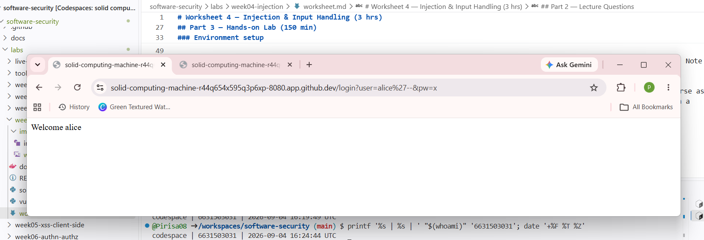
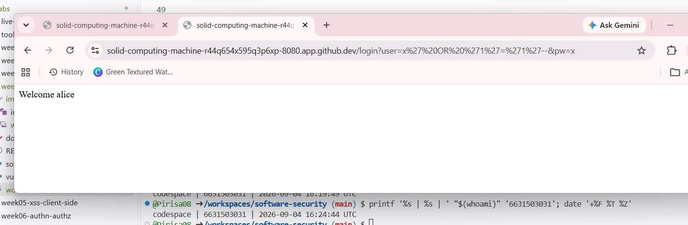

**Explanation:** The `--` sequence comments out the remaining password condition in the SQL query. The condition `'1'='1'` is always true, so when user input is concatenated directly into the SQL statement, it changes the query logic and allows authentication to be bypassed.

**Mitigation:** Use parameterized queries instead of building SQL statements with string concatenation. Parameters are treated as data rather than SQL syntax, preventing attacker input from changing the structure of the query. (CWE-89)

**Task 2 — Credential dump via UNION SQLi (30 min) 🐉 Hit #2.**
- *Goal:* exfiltrate every username **and password** from the `users` table.
- *Steps:* request `/search?q=' UNION SELECT username,password FROM users--`. Confirm `alice:alicepw` and `bob:bobpw` appear.
- *Deliverable:* payload + screenshot of dumped credentials + note on why column count must match.

**ANS** Result: The UNION-based SQL injection dumped all users: alice:alicepw, bob:bobpw, and admin:FLAG{sqli_demo} — exposing the lab's per-student SQLi flag through the admin account's password field.

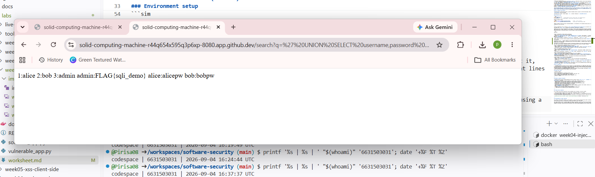

Explanation: The injected UNION SELECT must return the same number of columns as the original query so that the database can combine both result sets. In this case, both queries return two columns, allowing the usernames and passwords to appear in the response.
 
**Task 3 — OS command injection (30 min) 🐉 Hit #3.**
- *Goal:* run an arbitrary command through `/ping`.
- *Steps:* request `/ping?host=127.0.0.1;id` then `/ping?host=$(whoami)` (URL-encode if needed). Capture the injected command's output.
- *Deliverable:* both payloads + screenshot of `id`/`whoami` output + explanation of the `shell=True` flaw (CWE-78).

**ANS** **Result:** The `/ping` endpoint allowed shell commands to be interpreted from the `host` parameter. Using `127.0.0.1;id` caused the `id` command to run, and `$(whoami)` was also interpreted by the shell.

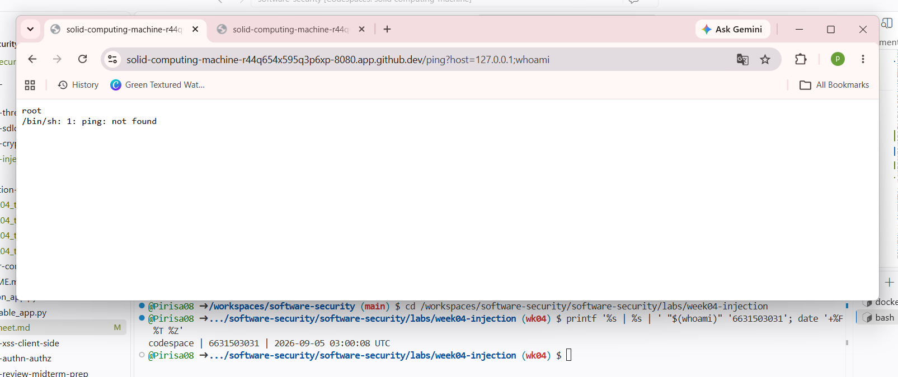

**Mitigation:** The vulnerability exists because `subprocess.run()` uses `shell=True`, so shell metacharacters in user input are treated as commands. The fix is to avoid the shell and pass arguments as a list, such as `["ping", "-c", "1", host]`, together with allow-list validation. (CWE-78)

**Task 4 — Unrestricted upload (25 min) 🐉 Hit #4.**
- *Goal:* show the upload accepts a dangerous file type with no checks (CWE-434).
- *Steps:* `GET /upload` (form), then upload a file named `shell.py`. Confirm `saved to /tmp/uploads/shell.py`. Discuss: if `UPLOAD_DIR` were web-served or executed, this is the RCE chain (here the dir is **not** served, so document the missing control rather than claiming auto-RCE).
- *Deliverable:* upload command/screenshot + 2–3 sentences on why extension allow-listing matters.

**ANS** Result: The /upload endpoint accepted a file named shell.py with no validation on file extension or content, saving it directly to /tmp/uploads/shell.py.

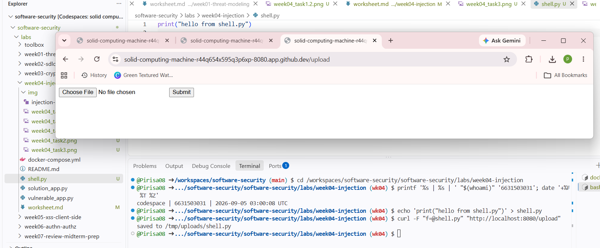

Mitigation: The application must validate the file extension against an allow-list (e.g. only .jpg, .png, .pdf) before saving, and sanitize the filename with a function like secure_filename() to prevent path traversal. Without these controls, if the upload directory were ever web-served or its contents executed by another process, this would become a full remote-code-execution chain (CWE-434).

**Task 5 — Defend / fix it (35 min) 🛡️ Boss defeated.**
- *Goal:* prove `solution_app.py` blocks Tasks 1–4.
- *Steps:* stop the vulnerable container (`Ctrl-C`), then run the fixed app on the same compose env:
  ```bash
  docker compose run --rm --service-ports injection-lab bash -c "pip install --no-cache-dir flask && python solution_app.py"
  ```
  Re-fire each payload from Tasks 1–4. Expected: `Login failed`, no credential dump, `invalid host` (400) on `127.0.0.1;id`, and `file type not allowed` for `shell.py`.
- *Deliverable:* screenshots of all four failures + name the fix line for each (parameterized query L52–55 login / L62–66 search, `shell=False`+regex L74–77, `secure_filename`+allow-list L86–93).

**ANS**
**Re-test 1 — Login bypass:**
Payloads `user=alice'--&pw=x` and `user=x' OR '1'='1'--&pw=x` both returned `Login failed` instead of `Welcome alice`.
**Fix line:** The login query now uses `db().execute("SELECT id, username FROM users WHERE username = ? AND password = ?", (user, pw))` — a parameterized query where `?` placeholders bind user input as data, so the injected `'--` and `OR '1'='1'` are treated as literal string content, not SQL syntax.

**Re-test 2 — UNION credential dump:**
Payload `q=' UNION SELECT username,password FROM users--` returned an empty result instead of dumping `alice:alicepw` / `bob:bobpw`.
**Fix line:** The search query uses `db().execute("SELECT id, username FROM users WHERE username LIKE ?", ("%" + term + "%",))`. Because the entire payload is bound as one parameter value inside the `LIKE` pattern, the database never parses it as a second `SELECT` statement, so no UNION injection is possible.

**Re-test 3 — OS command injection:**
Payload `host=127.0.0.1;whoami` returned `invalid host` (HTTP 400) instead of executing `whoami`.
**Fix line:** The ping route validates input with `re.fullmatch(r"[A-Za-z0-9_.-]+", host)` before running the command, and calls `subprocess.run(["ping", "-c", "1", host], shell=False, ...)`. The regex rejects the `;` metacharacter outright, and even if it passed, `shell=False` with an argument list means the OS never spawns a shell to interpret metacharacters in the first place.

**Re-test 4 — Unrestricted upload:**
Uploading `shell.py` via `curl -F "f=@shell.py" ".../upload"` returned `file type not allowed` instead of `saved to /tmp/uploads/shell.py`.
**Fix line:** The upload route sanitizes the name with `secure_filename(f.filename)` and checks the extension against `ALLOWED_EXT = {".txt", ".png", ".jpg", ".pdf"}`. Since `.py` is not in this allow-list, the file is rejected with a 400 before `f.save(dest)` is ever called.

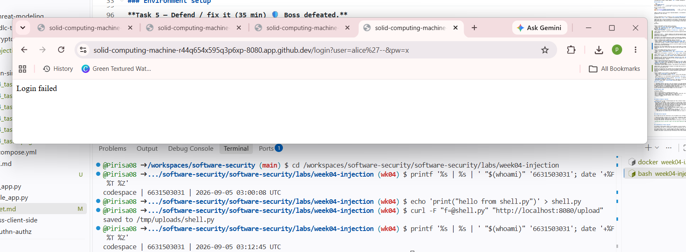
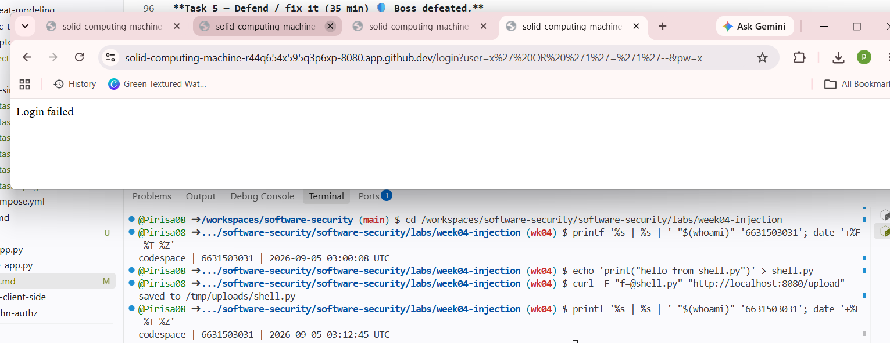
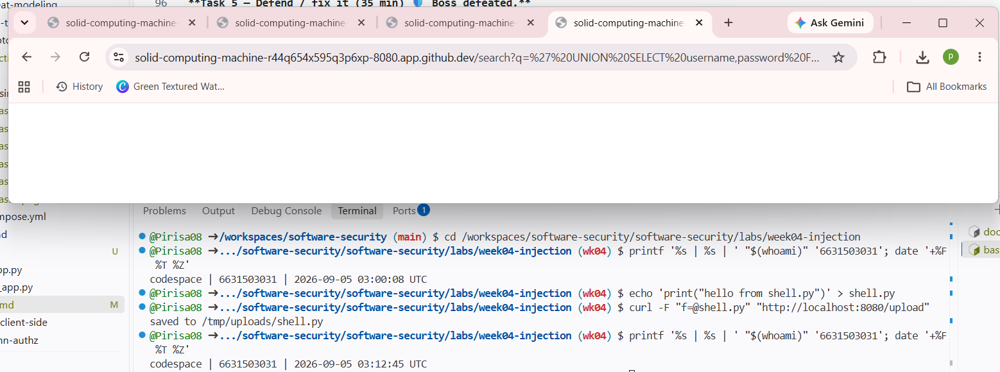
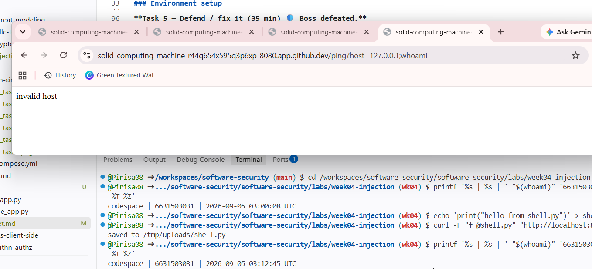
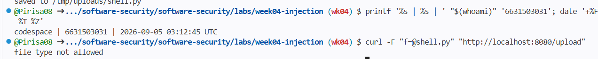

**Overall conclusion:** All four exploits that succeeded against `vulnerable_app.py` failed identically against `solution_app.py`, confirming that parameterized queries, `shell=False` with argument arrays plus input validation, and extension allow-listing with filename sanitization are effective, verified mitigations for CWE-89, CWE-78, and CWE-434 respectively.

## Part 4 — Reflection

1. **CWE/OWASP mapping:** map each of your four exploits to its CWE (89/78/434) and to OWASP 2025 **A05 Injection**.

**ANS** Tasks 1–2 (login bypass, UNION dump) → **CWE-89**; Task 3 (`/ping`) → **CWE-78**; Task 4 (upload) → **CWE-434**. All three fall under **OWASP A05 – Injection**, since each let untrusted input reach a powerful interpreter (SQL engine, shell, filesystem) unchecked.

2. **Real breach:** the **2017 Equifax breach** exposed ~147M people after attackers exploited a known input-handling flaw (Apache Struts CVE-2017-5638). In 3–4 sentences, connect that failure to the lessons in this lab (untrusted input reaching a powerful interpreter; the cost of an unpatched/unvalidated input path).

**ANS** Attackers exploited an unpatched Apache Struts flaw (CVE-2017-5638) that let a malicious HTTP header be executed as OS commands — a patch was released on March 7, 2017, and administrators were told to apply it on March 9, but the employee responsible didn't, and attackers exploited the exact vulnerability just three days later on March 10. It mirrors this lab: untrusted input reaching a command interpreter with no validation, and a known, patchable flaw left open leading to 147.9 million people's data being exposed.

3. **Best mitigation:** of parameterized queries, allow-list validation, least privilege, and avoiding `shell=True`, which single control would have prevented the most damage in this lab, and why?

**ANS** **Parameterized queries**, since Tasks 1–2 (SQLi) caused the worst outcome — full auth bypass plus a complete credential dump — while Task 3/4 didn't reach full RCE in this lab's setup. Parameterization also fixes the root cause structurally, not just narrows attack surface like allow-listing or least privilege do.

## Grading rubric (100)

| Criterion | Points |
|-----------|-------:|
| Part 2 — Lecture questions (conceptual accuracy) | 20 |
| Part 3 — Exploitation + evidence (payloads + screenshots, Tasks 1–4) | 40 |
| Part 3 — Defense (Task 5: fixes proven, lines cited) | 25 |
| Part 4 — Reflection (CWE/OWASP mapping, breach, mitigation) | 15 |
| **Total** | **100** |

---

## Evidence & Integrity (required)

- **Identity proof:** every screenshot/diagram must show a terminal running `printf '%s | %s | ' "$(whoami)" '<YOUR-STUDENT-ID>'; date '+%F %T %Z'` **in the
  same image as the evidence**. When the evidence is a browser page, a DevTools panel or a
  rendered response, put that terminal **beside the browser and capture the whole screen** — a
  cropped window carries nothing that identifies you, and the lab's own output is
  byte-identical for the whole cohort *by design*, so the stamp is the only thing that makes
  the shot yours. Generic or borrowed evidence is not accepted.
- **Personalized flag (if this lab issues one):** ____________________
  *Flags are unique per student — submitting another student's flag is a violation. How to submit: **learn.zcr.ai/submit** (full guide: `SUBMISSION.md` in the repo root).*
  
- - **Personalized flag (if this lab issues one):** SQLi flag: FLAG{sqli_demo} (via /search UNION SELECT) | CMDi flag: FLAG{cmdi_demo} (via /ping?host=127.0.0.1;cat /flag.txt)
  
- **Explain in your own words** *(graded on your reasoning, not copied text):*
  1. What did you do, and **why did the vulnerability work**?
  ANS:  I exploited SQL injection by sending `alice'--` and `x' OR '1'='1'--` in the login form, and OS command injection by sending `127.0.0.1;whoami` to `/ping`. Both worked because the vulnerable app concatenated my raw input directly into a SQL string and a shell command, so my special characters (`--`, `'`, `;`) were parsed as *code* by the database/shell instead of being treated as plain data.

  2. **Why does your fix actually stop it** — and what could still break it?
  ANS: My fix stops it because `solution_app.py` uses parameterized queries (`?` placeholders) for SQL and `subprocess.run(..., shell=False)` with an argument array plus a regex allow-list for `/ping`, so injected characters are always treated as literal data, never as syntax. It could still break if a developer later reverts to string concatenation for a *new* endpoint, or if the regex allow-list is too permissive (e.g. forgetting to block spaces or newlines).

---

## 🤖 Audit the AI (required)

AI is a power tool you must **distrust** — you are graded on your *critique*, not the AI's answer.

1. Ask an AI assistant to exploit **or** fix this week's vulnerability. Paste its full answer.

> "You can fix this by blacklisting dangerous characters before running the command:
> ```python
> host = request.args.get("host", "")
> for ch in [";", "|", "&"]:
>     host = host.replace(ch, "")
> subprocess.run("ping -c 1 " + host, shell=True)
> ```
> This removes the characters attackers use to inject commands."

2. **Find what's wrong or risky** in it — insecure code, a subtly incomplete fix, a hallucinated API/function/CVE, a missed edge case, or wrong reasoning. Quote the exact line(s).

The line `for ch in [";", "|", "&"]:` is an **incomplete blacklist** — it misses other shell metacharacters like `` ` `` (backticks), `$()`, newlines, and spaces used for chaining (e.g. `$(whoami)` still works since `$`, `(`, `)` aren't blocked). Worse, it keeps `shell=True`, so the root cause (a real shell interpreting the string) is never removed — any metacharacter the blacklist misses is still exploitable.

3. Produce the **correct, verified** version yourself and explain in 2–3 sentences why the AI's output was insufficient.

Correct version:** Use `subprocess.run(["ping", "-c", "1", host], shell=False)` plus `re.fullmatch(r"[A-Za-z0-9_.-]+", host)` as in `solution_app.py`. This is safer because removing the shell entirely means there's no interpreter left for *any* metacharacter to exploit, whereas a blacklist only blocks characters the developer thought of — new bypass characters (backticks, `\n`, `%0a`) are easy to miss.


> Disclose your AI use in the Part 1 table. This task counts toward your **Defense + Reflection** score.

---

## 🧠 Comprehension & Prompt (required)

**A. Explain in Plain English (EiPE).** In 2–3 sentences, in your own words, describe what this week's vulnerable code/endpoint actually *does* and *why it is exploitable* — explain the mechanism, don't dump jargon.

ANS: The `/ping` endpoint takes a `host` value from the URL and runs it inside a shell command (`ping -c 1 <host>`) without checking what's in it. Because the shell reads the whole string as one command line, any user can add extra shell syntax like `;whoami` to make the server run a completely different command of their choosing.

**B. Prompt Problem.** Write a **single prompt** that makes an AI produce a *correct, secure* fix for one finding. Run it: does the exploit now fail? If not, refine the prompt and try again. Submit the **final prompt + the verified result**.
*Graded on the prompt's precision and your verification — this trains problem decomposition and AI literacy (Denny et al. 2024).*

ANS: **Prompt used:** *"Fix this Flask endpoint so it is safe from OS command injection: it currently runs `subprocess.run('ping -c 1 ' + host, shell=True)` where `host` comes from `request.args`. Do not use a blacklist — use `shell=False` with an argument list, and validate `host` with a strict allow-list regex before running the command. Show the corrected code only."*

**Result:** Re-firing `host=127.0.0.1;whoami` against the AI's corrected code returned `invalid host` (400) — the exploit failed, confirming the fix works.